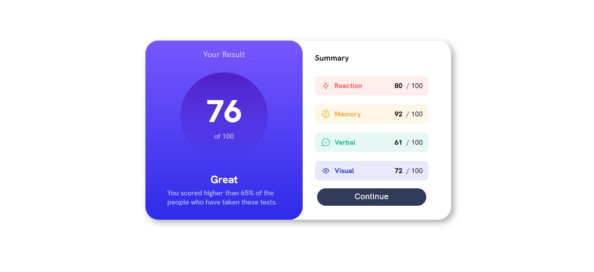

# Frontend Mentor - QR code component solution

Essa é minha solução para o [Desafio do componente de resumo de resultados no Frontend Mentor](https://www.frontendmentor.io/challenges/results-summary-component-CE_K6s0maV). Os desafios do Frontend Mentor lhe ajudam a aprimorar habilidades de codificação construindo projetos realistas. 

[Clique aqui](README.md) para retornar a versão em inglês.

## Table of contents

- [Overview](#overview)
  - [O desafio](#o-desafio)
  - [Screenshot](#screenshot)
  - [Links](#links)
- [Meu progreso](#meu-progresso)
  - [Feito com](#feito-com)
  - [O que aprendi](#o-que-aprendi)
- [Autor](#autor)
- [Conhecimentos](#conhecimentos)

## Overview

### O desafio

Os usuários devem ser capazes de:

- Ver o layout ideal dependendo do tamanho da tela do dispositivo
- Ver os estados de foco para elementos interativos

### Screenshot

### Links

- Solution URL: [Solution](#)
- Live Site URL: [Live Site](#)

## Meu progresso

Esse projeto me levou 4 horas e 25 minutos para terminar

### Feito com

- HTML5 semântico
- HTML & CSS puro
- Flexbox
- Media Query
- Mobile-first workflow

### O que aprendi

Apenas seguindo minha quest em aprender mais sobre Media Queries e flexbox. Ainda encontrando dificuldades, mas esse projeto abriu meus olhos. Também aprendi a usar mais divs para organizar mínimos detalhes.

## Autor

- Frontend Mentor - [@Gabriel-H502](https://www.frontendmentor.io/profile/Gabriel-H502)
- FreeCodeCamp - [@Gabriel-H502](https://www.freecodecamp.org/Gabriel-H502) 
- GitHub - [Gabriel-H502](https://github.com/Gabriel-H502)

## Conhecimentos

Usei IA para tirar minhas dúvidas APENAS. Esta seria [You.com](https://you.com/)