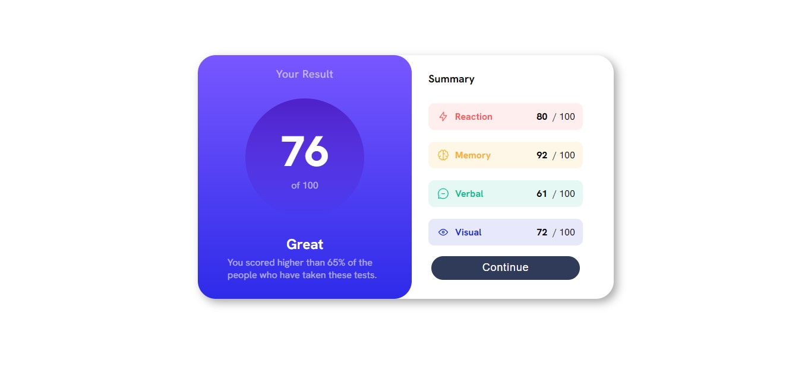

# Frontend Mentor - Results summary component solution

This is a solution to the [Results summary component challenge on Frontend Mentor](https://www.frontendmentor.io/challenges/results-summary-component-CE_K6s0maV). Frontend Mentor challenges help you improve your coding skills by building realistic projects. 

[Click here](README-br.md) to see a brazilian version.

## Table of contents

- [Overview](#overview)
  - [The challenge](#the-challenge)
  - [Screenshot](#screenshot)
  - [Links](#links)
- [My process](#my-process)
  - [Built with](#built-with)
  - [What I learned](#what-i-learned)
  - [Continued development](#continued-development)
- [Author](#author)
- [Acknowledgments](#acknowledgments)

## Overview

### The challenge

Users should be able to:

- View the optimal layout for the interface depending on their device's screen size
- See hover and focus states for all interactive elements on the page

### Screenshot

### Links

- Solution URL: [Solution](#)
- Live Site URL: [Live Site](https://gabriel-h502.github.io/results-summary-component/)

## My process

This project took me 4 hours and 25 minutes to finish it

### Built with

- Semantic HTML5 markup
- Pure HTML & CSS
- Flexbox
- Media Query
- Mobile-first workflow

### What I learned

Just following my quest on learning more about Media Queries and flexbox. Still finding dificulties, but this project opened my eyes. Also learned to use more divs to organize minimal details.

## Author

- Frontend Mentor - [@Gabriel-H502](https://www.frontendmentor.io/profile/Gabriel-H502)
- FreeCodeCamp - [@Gabriel-H502](https://www.freecodecamp.org/Gabriel-H502) 
- GitHub - [Gabriel-H502](https://github.com/Gabriel-H502)

## Acknowledgments

I used AI to clear my doubts ONLY. This AI is [You.com](https://you.com/). 